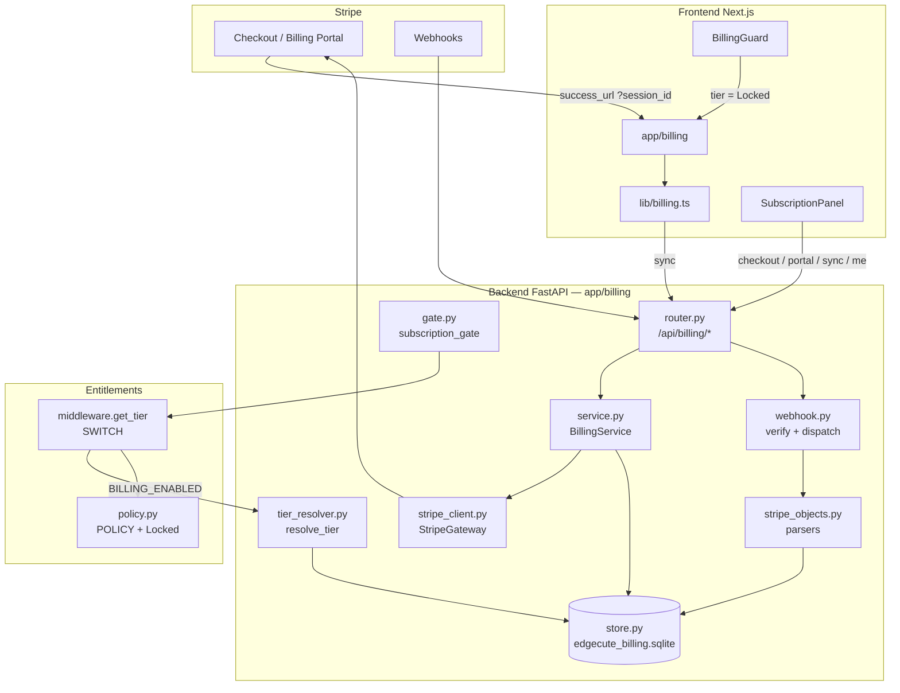
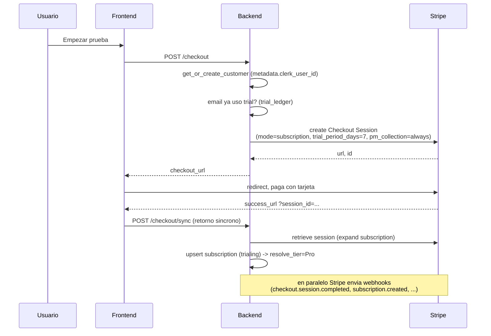
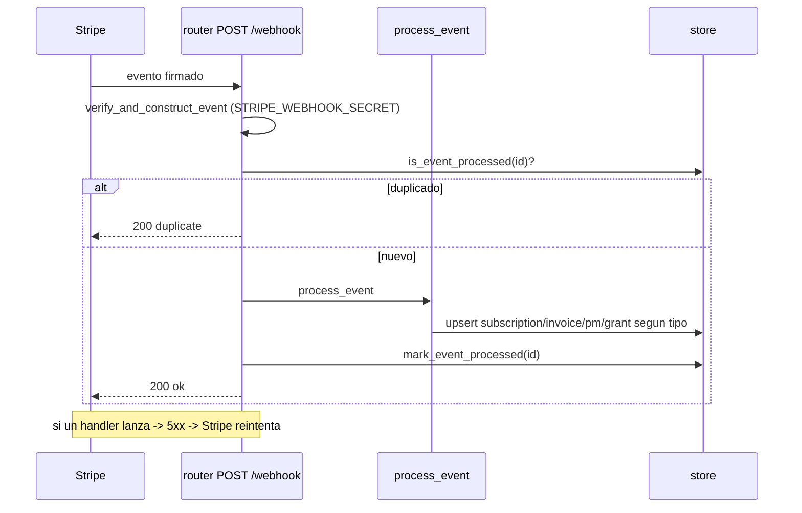
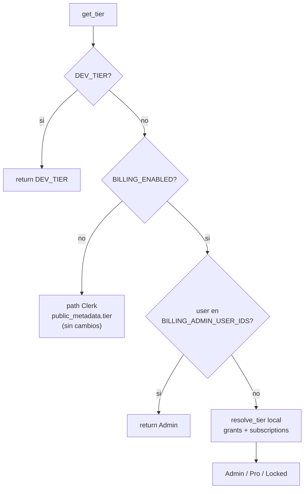

# Arquitectura de Billing (Stripe + Clerk) — Referencia

> **Qué es:** documentación de referencia del sistema de suscripciones/pagos integrado en Edgecute (Fases 2A–2G). Cubre backend y frontend, el modelo de datos, los flujos, la configuración y el estado de validación.
> **Estado:** construido y **dormido** en `develop`/staging tras dos flags. Prod (`main`) intacto. Validado e2e contra Stripe test (2026-08-19).
> **Diseño de origen:** `docs/FASE0_RECON_AUTH_TIERS_BILLING.md` (recon) · `docs/FASE1_DISENO_TRIAL_SUSCRIPCION_STRIPE.md` (diseño) · `docs/RUNBOOK_CUTOVER_BILLING_STAGING.md` (go-live).

## Índice
1. [Principios](#1-principios)
2. [Vista de alto nivel](#2-vista-de-alto-nivel)
3. [Modelo de datos](#3-modelo-de-datos)
4. [Backend — componentes](#4-backend--componentes)
5. [Frontend — componentes](#5-frontend--componentes)
6. [Flujos clave](#6-flujos-clave)
7. [Resolución de tier y gating](#7-resolución-de-tier-y-gating)
8. [Los dos flags (dormancia)](#8-los-dos-flags-dormancia)
9. [Variables de entorno](#9-variables-de-entorno)
10. [Tests](#10-tests)
11. [Mapa de fases](#11-mapa-de-fases)
12. [Seguridad, persistencia y datos sensibles](#12-seguridad-persistencia-y-datos-sensibles)
13. [Extensión planificada: trial granular por cliente](#13-extensión-planificada-trial-granular-por-cliente)

---

## 1. Principios

- **Fuente de verdad en capas.** Stripe = verdad del **cobro** (customer, subscription, invoices). Una **tabla local SQLite dedicada** = verdad del **estado que consume la app** (mirror materializado, reconstruible desde Stripe). Clerk = solo **identidad/sesión** (no se le escribe billing).
- **Dormancia total.** Todo el sistema nace detrás de dos flags (`BILLING_ENABLED` backend, `NEXT_PUBLIC_BILLING_ENABLED` frontend), **off por defecto**. Con los flags off, prod y staging se comportan **exactamente como antes**: `get_tier` sigue leyendo Clerk, el router `/api/billing/*` ni se monta, la UI de facturación no aparece y los gates son no-ops.
- **Fail-closed.** Cuando billing está encendido, quien no tiene suscripción/grant/admin resuelve a un tier nuevo **`Locked`** (todo cerrado). No hay que tocar `DEFAULT_TIER`: `get_tier` enruta por `resolve_tier`, cuyo default propio ya es `Locked`.
- **Aislamiento del store.** El SQLite de billing es un fichero **dedicado** (`EDGECUTE_BILLING_DB_PATH`), separado de `users.duckdb` (que se re-sube entero a GCS bajo lock global en cada escritura → inviable para webhooks) y del `edgecute_api.sqlite` del portal.
- **Idempotencia.** Los webhooks de Stripe se deduplican por `event.id`; todos los handlers son upserts idempotentes.

---

## 2. Vista de alto nivel

**En una frase:** el frontend habla con `/api/billing/*`; el backend crea sesiones de Checkout/Portal en Stripe y **materializa** el estado (via retorno síncrono + webhooks) en el store local; `get_tier` deriva el tier de ese store; los gates y el `BillingGuard` aplican el paywall.

---

## 3. Modelo de datos

SQLite dedicado (`store.py`), fichero en `EDGECUTE_BILLING_DB_PATH`. Siete tablas:

| Tabla | Rol | Claves |
|---|---|---|
| `billing_customers` | vínculo Clerk `user_id` ↔ Stripe `customer` (1:1) | PK `user_id`, UNIQUE `stripe_customer_id` |
| `subscriptions` | mirror de la suscripción de Stripe | PK `stripe_subscription_id`, idx `user_id` |
| `payment_methods` | tarjeta por defecto (marca/last4, **nunca PAN**) | PK `stripe_pm_id`, idx `user_id` |
| `invoices` | historial de facturas (metadatos + enlaces Stripe) | PK `stripe_invoice_id`, idx `user_id` |
| `entitlement_grants` | concesiones manuales (comped, migración-trial, admin) | PK `user_id` |
| `webhook_events` | idempotencia de webhooks | PK `stripe_event_id` |
| `trial_ledger` | anti-reciclaje del trial (email / card fingerprint) | PK `identity_key` |

- **`subscriptions.status`**: `trialing|active|past_due|canceled|unpaid|incomplete|incomplete_expired`.
- **`entitlement_grants.grant_tier`**: `Pro` (comped o `reason='migration-trial'`) | `Admin`. `expires_at` NULL = perpetuo.
- El mapeo estado→tier **no se persiste**: es la función pura `resolve_tier`.

DDL completo y comentado en `backend/app/billing/store.py` (`_init_schema`).

---

## 4. Backend — componentes

Todo bajo `backend/app/billing/` salvo donde se indica. **Ninguno importa Stripe en carga** (import lazy) → el paquete es importable sin la SDK ni claves, base de la dormancia.

| Módulo | Responsabilidad |
|---|---|
| `config.py` | Env: `BILLING_ENABLED`, `BILLING_DB_PATH`, claves/URLs de Stripe (vacías por defecto), ventanas de trial, display del plan. Sin secretos hardcodeados. |
| `store.py` | Clase `Store` thread-safe (`RLock` + 1 conexión, patrón `api_public`). CRUD/upserts de las 7 tablas; upserts **preservan `created_at`**; `mark_event_processed` (idempotencia atómica por PK); `record_trial`/`has_used_trial` (anti-reciclaje); invariante "un solo PM por defecto". Singleton `get_store()`/`set_store()`. |
| `tier_resolver.py` | `resolve_tier(user_id)` **puro**: grants (Admin>Pro) + subscription (`trialing/active/past_due`→Pro) → tier de `policy.POLICY`; nada/resto → `Locked`. Leaf sin imports de middleware/Clerk (testeable aislado). |
| `stripe_client.py` | `StripeGateway`: wrapper fino sobre la SDK (import **lazy**). `create_customer`, `create_checkout_session` (trial + `payment_method_collection=always`), `create_billing_portal_session`, `retrieve_checkout_session`, `list_subscriptions`. Sin clave → `StripeError` limpio. |
| `stripe_objects.py` | Parsers **puros** dict→campos de store para subscription/invoice/payment_method. **Defensivos** ante el drift de la API (p. ej. `current_period_end` en `items[]`, `invoice.subscription` en `parent.subscription_details`; refs id-string o expandidas). |
| `service.py` | `BillingService`: orquesta Stripe + store. `get_or_create_customer` (idempotente), `start_subscription_checkout` (decisión trial vs cobro directo por email), `open_billing_portal`, `sync_checkout_return` (retorno síncrono §4-5a), `reconcile_user/reconcile_all`, `get_billing_summary` (`GET /me`). Serializers dataclass→dict. |
| `webhook.py` | `verify_and_construct_event` (firma `STRIPE_WEBHOOK_SECRET`) + `process_event` (dispatch idempotente de la matriz §5). **Autoridad de `status` = eventos `subscription.*`** (los `invoice.*` solo escriben la factura). Anti-reciclaje por card fingerprint en `payment_method.attached`. |
| `gate.py` | `subscription_gate(feature)`: dependency de FastAPI. **No-op estricto con el flag off** (retorna True antes de tocar el token). Activo → `get_tier` (allowlist + `resolve_tier`) + `check_can` → 403 si no. |
| `router.py` | Rutas Clerk-authed `GET /me`, `POST /checkout`, `POST /checkout/sync`, `POST /portal`; y `POST /webhook` (**sin** auth — autenticidad = firma; dedup por `is_event_processed`, marca tras procesar → fallo=5xx=Stripe reintenta). |

**Integración con lo existente:**
- `entitlements/policy.py` — nuevo tier **`Locked`** (todo cerrado) + nueva feature-key `ticker.access` (solo Locked la cierra).
- `entitlements/middleware.py` — **`get_tier` es el SWITCH**: con `BILLING_ENABLED`, allowlist `BILLING_ADMIN_USER_IDS` + `resolve_tier(local)`; si no, path Clerk intacto. `DEV_TIER` sigue ganando.
- `main.py` — monta el router `/api/billing` **solo si `BILLING_ENABLED`**.
- Gates aplicados (`Depends(subscription_gate(...))`) en `routers/backtest.py` (`/backtest`,`/montecarlo`,`/what-if`→`backtester.run`), `routers/screener.py` (`/daily`→`screener.access`), `routers/strategies.py` (CRUD→`vault.access`), `routers/ticker_analysis.py` (`/{t}`,`/chart`,`/balance-sheet`,`/gap-stats`,`/sec-filings`→`ticker.access`).
- `scripts/seed_migration_trials.py` — siembra grants de trial 7d a usuarios actuales (idempotente, `--dry-run`).
- `requirements.txt` — `stripe==12.5.1` (uso lazy).

---

## 5. Frontend — componentes

Bajo `frontend/src/`. Alineado al branding del panel (UI kit `components/ui/` + tokens). Dormido tras `NEXT_PUBLIC_BILLING_ENABLED`.

| Fichero | Responsabilidad |
|---|---|
| `lib/billing.ts` | Cliente tipado sobre `apiRequest`: `me/checkout/portal/sync`. Tipos (`BillingSummary`, etc.), helpers `formatMoney/formatDate/daysUntil`, y el flag `BILLING_ENABLED`. |
| `components/billing/SubscriptionPanel.tsx` | La sección de facturación. Pinta los **4 estados** desde `GET /api/billing/me`: activa · en prueba (con contador) · pago fallido (`past_due`) · bloqueado (**paywall**). Botones a Checkout y Billing Portal. |
| `components/billing/BillingGuard.tsx` | Router del paywall: con el flag on y tier `Locked`, redirige a `/billing`. Montado en `LayoutShell` (rutas no-auth). |
| `app/billing/page.tsx` | Ruta `/billing`. Confirma la suscripción al volver de Checkout (`?session_id` → `sync`, §4-5a) y limpia la URL. |
| `components/Sidebar.tsx` | Enlace "Facturación" (icono `CreditCard`) **gateado por el flag**. |
| `components/LayoutShell.tsx` | Monta `<BillingGuard/>`. |

El diseño visual se validó primero como maqueta (artifact) antes de construir los componentes React.

---

## 6. Flujos clave

### 6.1 Alta con trial (Checkout)

El acceso **no depende del timing del webhook**: el retorno síncrono ya materializa la suscripción; el webhook confirma/consolida (idempotente).

### 6.2 Webhook

Matriz de eventos y efectos: `docs/FASE1_*` §5. Job de **reconciliación** (`reconcile_all`) cura divergencias por webhooks perdidos.

---

## 7. Resolución de tier y gating

### `get_tier(user_id)` (el switch)

### Gating de endpoints de producto
`subscription_gate(feature)` es un `Depends`:
- **Flag off** → retorna `True` **antes de tocar el token** (los endpoints hoy públicos siguen públicos; 0 coste Clerk/JWT).
- **Flag on** → resuelve identidad sin lanzar (`get_optional_user_id`), tier vía `get_tier`, `check_can(tier, feature)`; 403 si no. `Locked` cierra todas las features.

El **backend es el gate real**. El `BillingGuard` del frontend solo mejora UX (redirige `Locked`→`/billing`); el `useEntitlements` del front es optimista y **no** es la barrera.

---

## 8. Los dos flags (dormancia)

| Flag | Dónde | Efecto off (default) | Efecto on |
|---|---|---|---|
| `BILLING_ENABLED` | backend env | router `/api/billing` no se monta; `get_tier` lee Clerk; gates no-op | router montado; `get_tier`→`resolve_tier` local; gates activos; `Locked` es el fail-closed |
| `NEXT_PUBLIC_BILLING_ENABLED` | frontend build | sin enlace ni sección de billing; `BillingGuard` no redirige | UI de facturación visible; paywall/redirect activos |

**Se encienden juntos en el cutover** (staging primero). Rollback = apagar ambos → comportamiento de hoy.

---

## 9. Variables de entorno

**Backend**
| Var | Descripción |
|---|---|
| `BILLING_ENABLED` | master switch backend (default `false`) |
| `STRIPE_SECRET_KEY` | `sk_test_…` / `sk_live_…` |
| `STRIPE_PUBLISHABLE_KEY` | `pk_…` (frontend) |
| `STRIPE_PRICE_ID_MONTHLY_EUR` | Price único 29€/mes EUR |
| `STRIPE_WEBHOOK_SECRET` | `whsec_…` (verificación de firma) |
| `BILLING_SUCCESS_URL` / `BILLING_CANCEL_URL` / `BILLING_PORTAL_RETURN_URL` | URLs de retorno (`success` incluye `?session_id={CHECKOUT_SESSION_ID}`) |
| `EDGECUTE_BILLING_DB_PATH` | ruta del SQLite (¡volumen **persistente** en prod!) |
| `BILLING_TRIAL_DAYS` / `BILLING_MIGRATION_TRIAL_DAYS` | días de trial (default 7) |
| `BILLING_ADMIN_USER_IDS` | allowlist de admins (Clerk ids, coma-separados) |
| `BILLING_PLAN_LABEL` / `_AMOUNT_CENTS` / `_CURRENCY` / `_INTERVAL` | display del plan (fallback UI) |

**Frontend**
| Var | Descripción |
|---|---|
| `NEXT_PUBLIC_BILLING_ENABLED` | master switch frontend (default `false`) |
| `NEXT_PUBLIC_API_URL` | base del backend (ya existente) |

---

## 10. Tests

`backend/app/billing/tests/` — **80 tests** (`cd backend && python -m pytest app/billing/tests/ -v`):

| Fichero | Cubre |
|---|---|
| `test_store.py` (10) | roundtrips, upsert preserva `created_at`, dedup de webhooks, anti-reciclaje, persistencia |
| `test_tier_resolver.py` (20) | precedencia de grants, expiración, mapeo de estados §3, `Locked` cierra el catálogo, `DEFAULT_TIER` intacto |
| `test_service.py` (15) | customer idempotente, trial vs no-trial, portal, endpoints HTTP, `GET /me` |
| `test_stripe_objects.py` (5) | parsers con drift de campos entre versiones de la API |
| `test_webhook.py` (21) | cada handler de la matriz §5, idempotencia HTTP, bad-signature→400, sync return, reconcile |
| `test_gate.py` (8) | no-op dormido, anon/Locked→403, Pro/sub→pass, `ticker.access` fail-open vs Locked |
| `test_get_tier_billing.py` (6) | switch dormido=Clerk, billing anon→Locked, grant/sub→Pro, allowlist→Admin, DEV_TIER gana |

**Validación e2e (2026-08-19):** demo con el código real contra Stripe **test** → Checkout real → `sync` → `status=trialing`, trial 7d, tier **Pro**, `GET /me` correcto. Valida 2C+2D+2B+/me sin mocks.

---

## 11. Mapa de fases

| Fase | Entrega | Toca prod |
|---|---|---|
| **0** | Recon (read-only) | No |
| **1** | Diseño + decisiones cerradas | No |
| **2A** | Store aislado (`config`, `store`, tests) | No |
| **2B** | Tier `Locked` + `resolve_tier` | No (dormido) |
| **2C** | Stripe backend (Customer/Checkout/Portal) | No (tras flag) |
| **2D** | Webhook firmado + idempotente + reconciliación | No (tras flag) |
| **2E** | Gate de suscripción en endpoints de producto | No (tras flag) |
| **2F** | Frontend (sección billing + paywall + `/me`) | No (tras flag) |
| **2G** | Switch `get_tier` + seed migración + `BillingGuard` + runbook | No (tras flag) |

**Decisiones de producto** (montos, alcance del plan, trial, IVA, cancelación): ver `docs/FASE1_DISENO_TRIAL_SUSCRIPCION_STRIPE.md`. **Go-live:** `docs/RUNBOOK_CUTOVER_BILLING_STAGING.md`.

---

## 12. Seguridad, persistencia y datos sensibles

> Esta sección describe el **estado real** del almacenamiento del store de billing (no un ideal), qué contiene y qué **no**, y la checklist de blindaje para prod. Escrita tras verificar `store.py` y los mounts reales del host (2026-08-19).

### 12.1 Qué guarda el store (y qué NO)

El SQLite de billing es un **espejo materializado de Stripe**, no una base de datos de pagos primaria. Verificado en `store.py`:

| Dato almacenado | Sensibilidad | Nota |
|---|---|---|
| `email` (`billing_customers`) | **PII** | El dato más sensible del store |
| `user_id` Clerk ↔ `stripe_customer_id` (`cus_…`) | Correlación | Vincula identidad con cliente de Stripe |
| `brand` + `last4` + `exp_month/exp_year` (`payment_methods`) | **NO es dato PCI** | last4/marca son almacenables por diseño; no reconstruyen la tarjeta |
| IDs de Stripe (`sub_…`, `pm_…`, `in_…`), estados, importes, timestamps, `hosted_invoice_url`/`invoice_pdf` | Metadatos | Enlaces a Stripe, no contenido |

**Lo que NO toca nunca el servidor:** número de tarjeta (PAN), CVV, ni datos de autenticación de la tarjeta. Stripe los custodia íntegramente (Checkout/Portal son de Stripe) → **el peso de cumplimiento PCI-DSS recae en Stripe, no en Edgecute**. El store es **reconstruible desde Stripe** (`reconcile_all`), así que su pérdida no destruye la verdad del cobro; una fuga, sin embargo, **sí sería un incidente de PII** (emails + `cus_` + last4).

### 12.2 Persistencia (obligatoria) — la trampa del `/data`

El store **debe** vivir en un **volumen/bind mount persistente**, o se pierde en cada redeploy del contenedor (reconstruible, pero indeseable).

⚠️ **Trampa verificada en staging (2026-08-19):** el default `EDGECUTE_BILLING_DB_PATH` cae en el **CWD del contenedor** (capa efímera). En el contenedor de staging **no hay ningún mount montado en una ruta `/data/…` interna** — los binds del host (`/data/btt_lake`, `/data/btt_staging_cache`, `/data/btt_staging/users.duckdb`) se montan en `/lake`, `/tmp/btt_intraday_cache` y `/app/users.duckdb`. Es decir, una ruta `/data/x.sqlite` **dentro** del contenedor NO es persistente por sí sola.

**Solución aplicada:** añadir un bind mount dedicado y apuntar la env dentro de él:
- **Staging:** host `/data/btt_staging_billing` → contenedor `/data/btt_staging_billing`; `EDGECUTE_BILLING_DB_PATH=/data/btt_staging_billing/edgecute_billing.sqlite`.
- **Prod (futuro cutover):** carpeta **distinta y dedicada** (p. ej. `/data/btt_prod_billing`), **nunca** la de staging (aislamiento test/real). Env prod apuntando dentro de ese mount.

### 12.3 Control de acceso y "blindaje" — estado real

- **No expuesto por red.** El fichero no está en el webroot ni se sirve por HTTP; solo lo abre el proceso del backend y root del host. La superficie de ataque real es el **acceso SSH al host** y el acceso al contenedor.
- **Aislamiento test/prod.** Staging y prod son **contenedores co-ubicados en el mismo host**; el aislamiento lo dan carpetas separadas. El store de staging (datos de prueba: tarjetas `4242`, subs test, grants sembrados) **nunca** debe compartir carpeta con el de prod.
- **Permisos de fichero.** Recomendado `chmod 600` en el `.sqlite` y `700`/`750` en la carpeta, propiedad del usuario del proceso. **Aviso verificado:** `/data/btt_staging_cache` en el host está en `drwxrwxrwx` (**777, world-writable**) — la carpeta de billing **no** debe heredar ese permiso; créala restrictiva.
- **Secretos fuera del store.** Las claves de Stripe (`sk_…`, `whsec_…`) viven en **env** (Coolify), **no** en este fichero ni en el repo. El webhook se valida por **firma HMAC** (`STRIPE_WEBHOOK_SECRET`), no por confianza en el origen.

### 12.4 Cifrado en reposo — honestidad

- **Hoy NO hay cifrado a nivel de aplicación** del SQLite (no se usa SQLCipher ni equivalente).
- **Disco:** el dedicado Hetzner **no** va cifrado (LUKS) salvo que se configure explícitamente; asúmase **sin cifrado en reposo** por defecto.
- **Valoración:** dado que el store es un **mirror sin datos PCI** (no PAN/CVV) y reconstruible desde Stripe, el cifrado en reposo es un **hardening deseable, no un bloqueante** para el go-live. Si el modelo de amenaza lo exige (p. ej. requisito de cliente/compliance sobre la PII de emails), las opciones son: (a) SQLCipher para el fichero, (b) cifrado de disco/volumen (LUKS) en el host, (c) minimizar PII (no persistir `email`, resolverlo desde Stripe on-demand). Ninguna está implementada hoy — **queda como decisión consciente del cutover de prod**.

### 12.5 Checklist de blindaje para el cutover de PROD

- [ ] `EDGECUTE_BILLING_DB_PATH` en un **bind mount/volumen persistente dedicado de prod** (no el de staging, no el CWD).
- [ ] Carpeta creada con permisos restrictivos (`700`/`750`, no `777`); fichero `600`.
- [ ] Claves **Stripe LIVE** (`sk_live_`, `whsec_` del endpoint de prod) en env de Coolify, **nunca** en el repo.
- [ ] Backup/DR: confiar en `reconcile_all` como recuperación primaria; opcionalmente snapshot periódico del fichero.
- [ ] Decidir explícitamente el cifrado en reposo (§12.4) según el requisito de compliance del cliente.
- [ ] Verificar que el store de prod **no** comparte carpeta ni fichero con el de staging.

---

## 13. Extensión planificada: trial granular por cliente

> ⚠️ **NO CONSTRUIDA AÚN** — diseño aprobado, pendiente de implementar tras el e2e (pedido Al/Jesús 2026-08-19). Documentado aquí para que quede en la arquitectura; nada de esto está vivo todavía. Diseño detallado en `docs/FASE1_DISENO_TRIAL_SUSCRIPCION_STRIPE.md` §4.

**Necesidad:** dar **distintos días de prueba a distintos clientes** (trato especial a colegas): a unos 5, a otros 14, a otros 21… (escala 1–30).

**Decisión (Adrian): Path B — trial NATIVO de Stripe dinámico, keyed por `user_id`.** Frente a la alternativa de un grant local (Path A, que caduca contra el paywall), el Path B deja que **el trial viva en Stripe**: Stripe cuenta los días y **auto-convierte a pago** → más estable. Hoy el trial es un único valor global (`BILLING_TRIAL_DAYS=7`); esta extensión lo hace **por usuario**.

| Pieza | Cambio |
|---|---|
| **Tabla `trial_overrides`** (nueva, en el store) | `user_id` PK · `days` (1–30) · `reason` · `granted_by` · `created_at` · `consumed_at` |
| **`service.py` (checkout)** | `trial_days = override.days if override else (0 if used_trial else BILLING_TRIAL_DAYS)` → se inyecta en `stripe_client.py` como `trial_period_days` |
| **CLI `set_trial_override.py`** | admin, **solo servidor** (sin endpoint público); `--user-id`, `--days`, `--reason`, `--remove` |

**Anti-abuso (requisito explícito, "bien blindado"):** override solo por CLI admin · **un solo uso por `user_id`** (`consumed_at` al cuajar el checkout) · el `trial_ledger` (email + card fingerprint) sigue vivo para altas normales · Stripe dueño del trial (una vez por suscripción) · auditoría `granted_by`/`reason` · rango 1–30 validado.

**Decisión #1 pendiente (Adrian):** **B1** con tarjeta upfront (`payment_method_collection="always"`, recomendado, anti-abuso fuerte) vs **B2** sin tarjeta (`if_required`, más débil). Estimación ~4-5h. Aditivo y detrás del flag.
