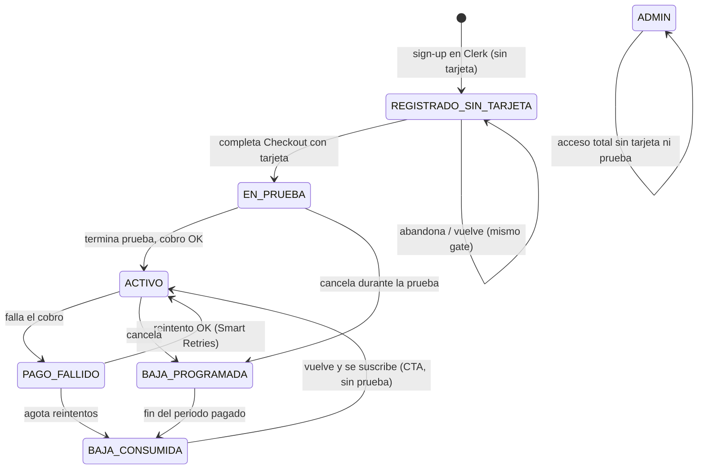
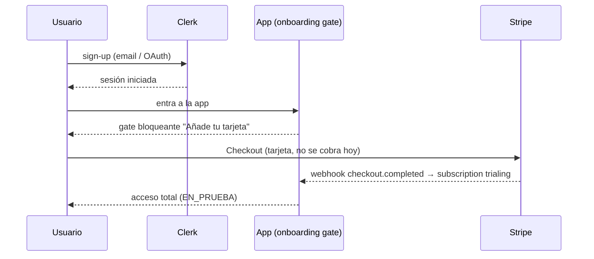

# Fase 3 — Flujo de suscripción para lanzamiento

> **Estado:** diseño (para mini-reu). Decisiones ① ② ③ ④ cerradas 2026-08-21; queda 1 matiz de copy y varias preguntas de implementación abiertas.
> **Rama:** develop (staging). **Prod:** intacto y dormido (`BILLING_ENABLED` sin activar).
> **Fuente:** `Suscripciones - Lanzamiento.pdf` (cliente) + decisiones Adrian/Jesús.

Este documento fija el **cambio de flujo** que pide el cliente para el lanzamiento: la tarjeta
deja de pedirse dentro del panel y pasa a exigirse en el **primer login**. La fontanería de
billing (store, webhooks, portal, gate backend) ya existe de Fase 2; esto reordena **dónde
vive el muro** y **los copys**, no reescribe el motor.

---

## 1. Modelo de producto (según el cliente)

- **No existe "plan PRO".** Hay **un solo producto**: *Edgecute*, con estado **En prueba** o
  **Activo**. Todos los usuarios tienen tarjeta introducida y están suscritos.
- **Sin tarjeta no se usa nada.** El producto entero está detrás del muro; no hay módulos
  gratuitos.
- **La prueba no es un accionable.** El usuario no pulsa "empezar prueba": la prueba arranca
  automáticamente al completar el registro **con tarjeta**.
- **Precio:** 29 €/mes tras la prueba. Sin permanencia.
- **Baja:** sin reembolsos; acceso hasta el último día del periodo ya pagado; baja efectiva a
  partir del siguiente periodo.
- **Admins:** exentos de tarjeta y de prueba.

---

## 2. Decisiones cerradas (2026-08-21)

| # | Decisión |
|---|----------|
| **①** | **Gate de tarjeta = opción A.** El usuario existe en Clerk pero queda **sin acceso a nada** hasta poner tarjeta. Si abandona el paso de tarjeta, al volver se le fuerza el **mismo gate** (no entra sin tarjeta). **Sin borrado de cuentas** (no se elimina de Clerk). |
| **②** | **Cutover = mismo `user_id`.** A los usuarios existentes se les cierra sesión y, al volver a entrar con **su mismo login**, se les fuerza el gate de tarjeta. **Conservan estrategias y backtests** (todo está scopeado por `user_id`). No se crean cuentas nuevas. |
| **③** | **Se gatea todo el producto.** Sin módulos gratis. |
| **④** | **Copy sin "Pro".** Etiqueta visible = **"Suscrito a Edgecute"** con estado *En prueba* / *Activo*. El enum interno sigue siendo `Pro` (invisible al usuario). |

### Módulos del producto (CERRADO 2026-08-21)
Los módulos accesibles son **Ticker Analysis · Screener · Backtester · Baúl de estrategias**
(4). **Market Analysis queda FUERA** del producto (aclaración del cliente: "Baúl sí, Market
Analysis no"). Implementado: bullets del gate/panel con los 4; Sidebar oculta los 2 enlaces de
Market Analysis (a `isAdmin()`); `policy.py` cierra `market.analysis.access` en el tier `Pro`
(no accesible por URL a suscriptores). El gate es el mismo (todo el producto dentro del muro).

---

## 3. Estados del usuario

| Estado | Mapea a | Acceso |
|--------|---------|--------|
| `REGISTRADO_SIN_TARJETA` | *(nuevo)* usuario en Clerk sin customer/subscription | ❌ 0 acceso — gate obligatorio |
| `EN_PRUEBA` | subscription `trialing` | ✅ total, cuenta atrás N días |
| `ACTIVO` | subscription `active` | ✅ total, cobrando 29 €/mes |
| `PAGO_FALLIDO` | subscription `past_due` | ✅ mientras Stripe reintenta |
| `BAJA_PROGRAMADA` | `active` + `cancel_at_period_end=true` | ✅ hasta fin de periodo |
| `BAJA_CONSUMIDA` | sin subscription activa + `has_used_trial=true` | ❌ panel con CTA Suscribirme |
| `ADMIN` | allowlist | ✅ total, sin tarjeta/prueba |

---

## 4. Flujos

### 4.1 Alta de usuario nuevo

- Si el usuario **no** completa el Checkout, sigue en `REGISTRADO_SIN_TARJETA`: al volver
  (mismo login) vuelve a ver el gate. No entra a la app.

### 4.2 Cutover de usuarios existentes (lanzamiento)
1. Se **cierra sesión a todos** (global sign-out).
2. Al volver a entrar con **su mismo login** (mismo `user_id`), caen en el **gate de tarjeta**.
3. Ponen tarjeta → arranca su prueba (los **favoritos de Álvaro** reciben más días vía el
   override por `user_id` ya implementado — ver §6).
4. **Conservan** estrategias y backtests (scopeados por `user_id`).

### 4.3 Baja que vuelve
- Mantiene sesión iniciada, aterriza en el **panel de Facturación** con CTA **Suscribirme**.
- Necesitamos saber del usuario: *existe / sin suscripción activa / ya usó la prueba*.
- Como ya usó la prueba (`has_used_trial`), el Checkout va **sin trial** → **cobro inmediato**.

---

## 5. Impacto en copys (por estado)

| Estado | Dónde | Texto clave |
|--------|-------|-------------|
| **Registrado sin tarjeta** | Onboarding bloqueante (post-login) | "Añade tu tarjeta para empezar tus N días gratis. No se te cobra hoy." · CTA **Añadir tarjeta y empezar** |
| **En prueba** | Panel Facturación | "Te quedan N días de prueba" · badge *En prueba* · **Suscrito a Edgecute** · "Al terminar la prueba: 29 €/mes" |
| **Activo** | Panel Facturación | badge *Activo* · **Suscrito a Edgecute** · "Próximo cobro: dd mmm" · **Gestionar facturación** |
| **Pago fallido** | Panel + aviso | "Ha fallado el cobro, reintentando. Actualiza tu tarjeta para no perder acceso." |
| **Baja programada** | Panel | "Tu suscripción termina el dd mmm. Mantienes acceso hasta esa fecha." |
| **Baja→vuelve** | Panel (con sesión) | "Reactiva tu suscripción a Edgecute — 29 €/mes." · CTA **Suscribirme** (sin mención a prueba) |
| **Admin** | Panel | "Acceso de administrador" · sin tarjeta ni prueba |

**Copy transversal:**
- ❌ Fuera **"Empezar prueba gratis"** como botón — la prueba ya no es un accionable.
- ❌ Fuera **"Edgecute Pro"** → **"Suscrito a Edgecute"**.
- Bullets de la tarjeta = **Ticker Analysis · Screener · Backtester** (los 3 del §1).

---

## 6. Qué se reutiliza vs. qué es nuevo

### ✅ Ya construido (Fase 2, no se toca)
- Store SQLite de suscripciones, webhooks firmados + idempotentes, Billing Portal.
- Gate backend por suscripción, `resolve_tier`, seed de migración.
- **Días preferenciales (favoritos de Álvaro)** → Path B / B1 ya implementado y pusheado
  (`e368839`), keyeado por `user_id`. Encaja directo con el cutover del §4.2.
- **Baja a fin de periodo, sin reembolso** → `cancel_at_period_end`.
- **Baja→vuelve = sin nueva prueba** → anti-recycle (trial ledger por email/fingerprint).
- **Admins exentos** → allowlist / `resolve_tier`.

### 🔧 Nuevo / a rehacer
1. ✅ **Onboarding gate post-login** (frontend `BillingGuard.tsx`): overlay **bloqueante a
   pantalla completa** (opción A, sin escape) que fuerza Checkout. Sustituye al redirect a
   `/billing`. Maneja el retorno de Checkout (sync + reload). *(commit `3d62180`)*
2. ✅ **Estado `onboarding` / `resubscribe`** en backend: `/api/billing/me` devuelve un campo
   `stage` (fuente única) que distingue nuevo (sin sub → onboarding) de baja→vuelve (sub previa
   → resubscribe) del resto (trialing/active/past_due/trial_grant/admin). Sin acceso = gate.
3. ✅ **La prueba deja de ser accionable**: fuera "Empezar prueba gratis"; el CTA es "Añadir
   tarjeta y empezar". El trial lo decide Stripe al completar Checkout.
4. ✅ **Copys**: "Suscrito a Edgecute" (sin "Pro"); onboarding/tarjeta; baja→vuelve con copy de
   reactivación (sin mención a prueba). Módulos = Ticker/Screener/Backtester.
5. ⏳ **Cutover**: mecanismo de **global sign-out** en el lanzamiento (mismo `user_id`) — OPS,
   pendiente (ver §7.2). No es código de la app.
6. ✅ **Nav lateral**: Baúl SE QUEDA (cliente lo confirma); **Market Analysis** (link normal +
   "MA · Adjusted") **oculto** a usuarios (gateado a `isAdmin()`, reversible). *(commit `abecd21`)*

### ⚠️ Nota de cutover que emergió al implementar
La **migración de Fase 2** daba a los usuarios existentes un **grant local de 7 días SIN
tarjeta** (acceso primero, tarjeta después). El modelo del cliente de Fase 3 es el contrario:
**tarjeta upfront para todos**, incluidos los existentes, con los **días que les correspondan**
(favoritos de Álvaro = más). → En el cutover de Fase 3 **no** se siembran grants card-less;
se siembran **`trial_overrides` (Path B) por `user_id`** para los días preferenciales y **todos
pasan por el gate de tarjeta**. (Los grants de migración quedan como camino heredado; decidir en
la reu si se retiran para el go-live de Fase 3.)

---

## 7. Preguntas abiertas para la reu / implementación

1. **Ventana del gate de onboarding:** ¿el usuario en `REGISTRADO_SIN_TARJETA` puede cerrar
   el modal y "mirar" la app en modo bloqueado, o el gate ocupa toda la pantalla sin escape?
   (Opción A implica sin escape.)
2. **Global sign-out del cutover:** ¿cómo se dispara (rotación de sesiones en Clerk vs. flag
   propio)? Impacto en usuarios a media sesión.
3. **`payment_method_collection`:** se mantiene `always` (tarjeta obligatoria en el Checkout
   del onboarding). Confirmar.
4. **Enum interno `Pro`:** se deja como está (invisible). Solo cambia el copy. Confirmado (④).

---

## 8. Cambios respecto a Fase 1/2 (registro de la desviación)

- **Fase 1/2 asumían** que la tarjeta se pedía cuando el usuario pulsaba un CTA **dentro** del
  panel de Facturación (flujo "opt-in" desde la app).
- **El cliente pide** capturar la tarjeta en el **primer login** (flujo "gate" pre-app), sin
  que el usuario pueda disparar/pausar la prueba.
- La lógica de Stripe (Checkout + `trial_period_days` + `payment_method_collection=always`)
  **no cambia**; cambia **cuándo y dónde** se invoca (onboarding en vez de panel).

---

## 9. Fixes tras la validación en staging (2026-08-21)

E2E del flujo probado en staging (gate → Checkout `4242` → panel "En prueba" + Visa ••4242):
**funciona**. Bugs encontrados y corregidos:

| # | Bug | Causa | Fix | Commit |
|---|-----|-------|-----|--------|
| A | **Admin veía el gate de tarjeta** | `/me` (`get_billing_summary`) usaba solo `resolve_tier` (grants+subs) e **ignoraba la allowlist** de admins → un admin salía `Locked` | `/me` resuelve la allowlist antes (tier=Admin), igual que `get_tier`; fuente única en `config.billing_admin_ids()`, middleware delega ahí | `fe458fa` |
| B | **Flash del panel antes del gate** | `BillingGuard` devolvía `null` mientras cargaba `/me` → la app se veía un instante | El guard **bloquea con loader full-screen** mientras verifica; fail-closed con reintento si `/me` falla. (El backend ya devolvía 403 en los endpoints → no había fuga de datos, solo visual.) | `fe458fa` |
| C | **Chip del sidebar mostraba "PRO"** | Pintaba el enum interno `tier` crudo | Con billing activo se mapea a "Suscrito a Edgecute" (o "Admin"); `LockedFeature` deja de decir "plan Pro" | `4cd8bd0` |
| D | **Panel de admin: 29€ y "—"** | El panel no distinguía admin | Rama admin: precio **0,00 €**, estado **"Acceso de administrador"**, sin botón de portal | `3da98c2` |

**Enforcement verificado:** los endpoints de producto (Backtester/Ticker/Screener/Baúl) llevan
`subscription_gate`, que con billing activo resuelve el tier (allowlist + store local) y devuelve
**403** a un `Locked`. El gate visual es UX; el muro real es el backend.

**Nota de prueba:** para probar el gate con una cuenta que tenía grant de migración se le borró
el grant en staging (`store.delete_grant`) → cayó en `stage: onboarding` → gate. Borrar el grant
**no cierra sesión** (el gate es in-app); el cierre de sesión global del cutover es aparte (ops).

---

## 10. Tier "gratis / cortesía" para colegas — análisis

**Requisito (Adrian, cliente):** unos usuarios (colegas) deben tener **el mismo acceso que los
que pagan, pero gratis, sin tarjeta y de forma indefinida**. No son admins (no tienen los poderes
internos de admin: Market Analysis, features en preview, etc.).

### La clave: el mecanismo YA existe
La tabla `entitlement_grants` + `resolve_tier` **ya conceden acceso perpetuo** con un grant
`grant_tier="Pro"` y `expires_at=None` (`_grant_is_active`: sin expiry = perpetuo). Es la misma
maquinaria del grant de migración, pero **sin caducidad** y con otra `reason`. → "acceso completo
gratis" **no necesita fontanería nueva**.

### Recomendación: grant de cortesía perpetuo (Opción A)
- Grant: `grant_tier="Pro"`, `expires_at=None`, `reason="comped"`, `granted_by="<admin>"`.
- `resolve_tier` → **Pro** → acceso a los 4 módulos (Ticker/Screener/Backtester/Baúl), **sin**
  Market Analysis (Pro lo tiene cerrado), **sin** poderes de admin → "igual que los que pagan".
- **Gate**: access=true → **nunca ve el muro de tarjeta**. Sin Stripe, sin tarjeta, sin cobro,
  sin facturas. Keyed por `user_id`; sobrevive al cutover (re-login → grant → acceso).

### Qué hay que construir (pequeño)
1. **Stage/label `comped`**: distinguir cortesía de prueba/pago para que el panel no mienta
   ("29€/mes", "primer cobro"). Regla: grant Pro con `expires_at is None` → `stage="comped"`.
   Copy del panel: "Acceso de cortesía · Gratis · Sin cobro", precio 0/oculto, sin botón de
   portal (igual que el tratamiento de admin ya hecho en §9-D).
2. **CLI de gestión** `scripts/set_comp.py` (`--user-ids`, `--reason`, `--grant|--revoke|--list`):
   reusa `store.upsert_grant`/`delete_grant`. **Solo servidor, sin endpoint público** (mismo
   guardarraíl que Path B / `set_trial_override`).
3. **Auditoría**: listar grants con `reason='comped'`.

### Decisiones a cerrar (esto es "cómo lo gestionamos")
- **a. ¿Reversible?** Si termina la cortesía → revocar grant → Locked → gate → pasaría por
  Checkout normal. (Opcional "amable": sembrarle antes un `trial_override` de N días.)
- **b. ¿Feature-set idéntico a Pro?** Recomendado sí (los 4 módulos). Si los colegas debieran
  tener algo distinto (p.ej. Market Analysis), eso ya pediría un tier dedicado.
- **c. Wording al colega:** ¿ve "Cortesía/Invitado/Gratis" o simplemente "Suscrito a Edgecute"
  sin precio? Recomendado: etiqueta discreta "Cortesía" + panel sin precio/renovación.
- **d. Alta:** el grant necesita `user_id` → el colega debe **registrarse en Clerk primero**,
  luego se le concede. ⚠️ Ventana: si carga la app antes de que le demos el grant, verá el gate.
  Para fricción cero habría que **pre-conceder por email** (materializar en el primer login) —
  eso sí es código extra. MVP: conceder por `user_id` tras registro (puede ver el gate hasta
  que se le concede).

### Alternativas descartadas
- **Tier `Comped` dedicado en `policy.py`**: más código, duplica el feature-set de Pro,
  `resolve_tier` tendría que aceptar un `grant_tier` nuevo. Solo valdría si el feature-set fuese
  distinto de Pro.
- **Cupón Stripe 100% off**: seguiría pidiendo tarjeta/Checkout y mete al colega en Stripe;
  contradice "sin pagar". Descartado.

### Esfuerzo
Pequeño: el acceso es gratis (ya existe). Falta stage+copy (como el de admin), la CLI y tests.

