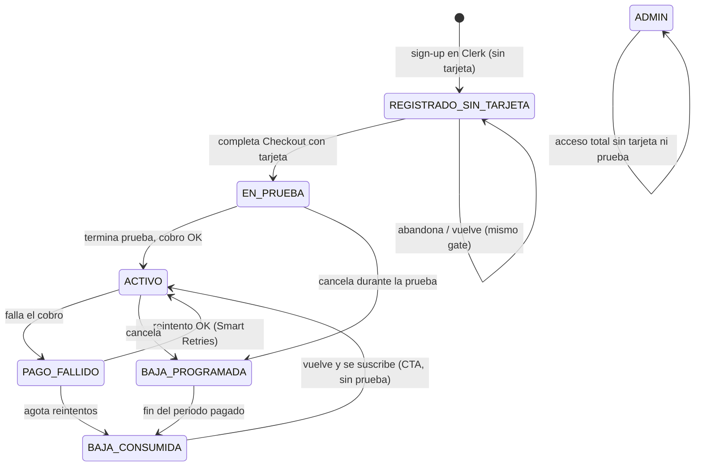
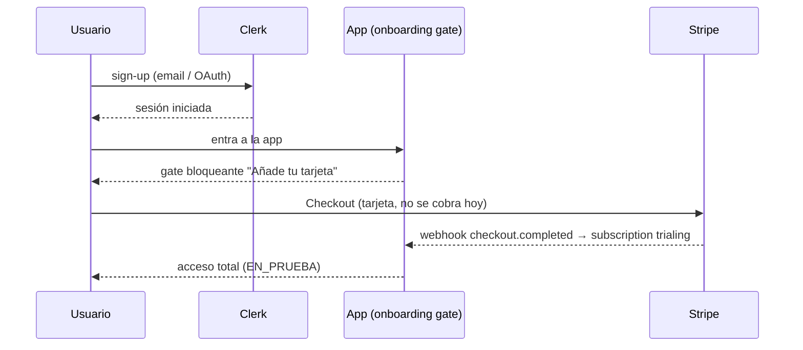

# Fase 3 — Flujo de suscripción para lanzamiento

> **Estado:** diseño (para mini-reu). Decisiones ① ② ③ ④ cerradas 2026-08-21; queda 1 matiz de copy y varias preguntas de implementación abiertas.
> **Rama:** develop (staging). **Prod:** intacto y dormido (`BILLING_ENABLED` sin activar).
> **Fuente:** `Suscripciones - Lanzamiento.pdf` (cliente) + decisiones Adrian/Jesús.

Este documento fija el **cambio de flujo** que pide el cliente para el lanzamiento: la tarjeta
deja de pedirse dentro del panel y pasa a exigirse en el **primer login**. La fontanería de
billing (store, webhooks, portal, gate backend) ya existe de Fase 2; esto reordena **dónde
vive el muro** y **los copys**, no reescribe el motor.

---

## 1. Modelo de producto (según el cliente)

- **No existe "plan PRO".** Hay **un solo producto**: *Edgecute*, con estado **En prueba** o
  **Activo**. Todos los usuarios tienen tarjeta introducida y están suscritos.
- **Sin tarjeta no se usa nada.** El producto entero está detrás del muro; no hay módulos
  gratuitos.
- **La prueba no es un accionable.** El usuario no pulsa "empezar prueba": la prueba arranca
  automáticamente al completar el registro **con tarjeta**.
- **Precio:** 29 €/mes tras la prueba. Sin permanencia.
- **Baja:** sin reembolsos; acceso hasta el último día del periodo ya pagado; baja efectiva a
  partir del siguiente periodo.
- **Admins:** exentos de tarjeta y de prueba.

---

## 2. Decisiones cerradas (2026-08-21)

| # | Decisión |
|---|----------|
| **①** | **Gate de tarjeta = opción A.** El usuario existe en Clerk pero queda **sin acceso a nada** hasta poner tarjeta. Si abandona el paso de tarjeta, al volver se le fuerza el **mismo gate** (no entra sin tarjeta). **Sin borrado de cuentas** (no se elimina de Clerk). |
| **②** | **Cutover = mismo `user_id`.** A los usuarios existentes se les cierra sesión y, al volver a entrar con **su mismo login**, se les fuerza el gate de tarjeta. **Conservan estrategias y backtests** (todo está scopeado por `user_id`). No se crean cuentas nuevas. |
| **③** | **Se gatea todo el producto.** Sin módulos gratis. |
| **④** | **Copy sin "Pro".** Etiqueta visible = **"Suscrito a Edgecute"** con estado *En prueba* / *Activo*. El enum interno sigue siendo `Pro` (invisible al usuario). |

### Módulos del producto (CERRADO 2026-08-21)
Los módulos accesibles son los **3 que indica el doc del cliente**: **Ticker Analysis ·
Screener · Backtester**. Las capturas antiguas del panel listaban además Baúl de estrategias
y Market Analysis (5); **se descartan de los bullets** de la tarjeta de suscripción. El gate
es el mismo (todo el producto dentro del muro).

---

## 3. Estados del usuario

| Estado | Mapea a | Acceso |
|--------|---------|--------|
| `REGISTRADO_SIN_TARJETA` | *(nuevo)* usuario en Clerk sin customer/subscription | ❌ 0 acceso — gate obligatorio |
| `EN_PRUEBA` | subscription `trialing` | ✅ total, cuenta atrás N días |
| `ACTIVO` | subscription `active` | ✅ total, cobrando 29 €/mes |
| `PAGO_FALLIDO` | subscription `past_due` | ✅ mientras Stripe reintenta |
| `BAJA_PROGRAMADA` | `active` + `cancel_at_period_end=true` | ✅ hasta fin de periodo |
| `BAJA_CONSUMIDA` | sin subscription activa + `has_used_trial=true` | ❌ panel con CTA Suscribirme |
| `ADMIN` | allowlist | ✅ total, sin tarjeta/prueba |

---

## 4. Flujos

### 4.1 Alta de usuario nuevo

- Si el usuario **no** completa el Checkout, sigue en `REGISTRADO_SIN_TARJETA`: al volver
  (mismo login) vuelve a ver el gate. No entra a la app.

### 4.2 Cutover de usuarios existentes (lanzamiento)
1. Se **cierra sesión a todos** (global sign-out).
2. Al volver a entrar con **su mismo login** (mismo `user_id`), caen en el **gate de tarjeta**.
3. Ponen tarjeta → arranca su prueba (los **favoritos de Álvaro** reciben más días vía el
   override por `user_id` ya implementado — ver §6).
4. **Conservan** estrategias y backtests (scopeados por `user_id`).

### 4.3 Baja que vuelve
- Mantiene sesión iniciada, aterriza en el **panel de Facturación** con CTA **Suscribirme**.
- Necesitamos saber del usuario: *existe / sin suscripción activa / ya usó la prueba*.
- Como ya usó la prueba (`has_used_trial`), el Checkout va **sin trial** → **cobro inmediato**.

---

## 5. Impacto en copys (por estado)

| Estado | Dónde | Texto clave |
|--------|-------|-------------|
| **Registrado sin tarjeta** | Onboarding bloqueante (post-login) | "Añade tu tarjeta para empezar tus N días gratis. No se te cobra hoy." · CTA **Añadir tarjeta y empezar** |
| **En prueba** | Panel Facturación | "Te quedan N días de prueba" · badge *En prueba* · **Suscrito a Edgecute** · "Al terminar la prueba: 29 €/mes" |
| **Activo** | Panel Facturación | badge *Activo* · **Suscrito a Edgecute** · "Próximo cobro: dd mmm" · **Gestionar facturación** |
| **Pago fallido** | Panel + aviso | "Ha fallado el cobro, reintentando. Actualiza tu tarjeta para no perder acceso." |
| **Baja programada** | Panel | "Tu suscripción termina el dd mmm. Mantienes acceso hasta esa fecha." |
| **Baja→vuelve** | Panel (con sesión) | "Reactiva tu suscripción a Edgecute — 29 €/mes." · CTA **Suscribirme** (sin mención a prueba) |
| **Admin** | Panel | "Acceso de administrador" · sin tarjeta ni prueba |

**Copy transversal:**
- ❌ Fuera **"Empezar prueba gratis"** como botón — la prueba ya no es un accionable.
- ❌ Fuera **"Edgecute Pro"** → **"Suscrito a Edgecute"**.
- Bullets de la tarjeta = **Ticker Analysis · Screener · Backtester** (los 3 del §1).

---

## 6. Qué se reutiliza vs. qué es nuevo

### ✅ Ya construido (Fase 2, no se toca)
- Store SQLite de suscripciones, webhooks firmados + idempotentes, Billing Portal.
- Gate backend por suscripción, `resolve_tier`, seed de migración.
- **Días preferenciales (favoritos de Álvaro)** → Path B / B1 ya implementado y pusheado
  (`e368839`), keyeado por `user_id`. Encaja directo con el cutover del §4.2.
- **Baja a fin de periodo, sin reembolso** → `cancel_at_period_end`.
- **Baja→vuelve = sin nueva prueba** → anti-recycle (trial ledger por email/fingerprint).
- **Admins exentos** → allowlist / `resolve_tier`.

### 🔧 Nuevo / a rehacer
1. **Onboarding gate post-login** (frontend): interstitial bloqueante que fuerza Checkout
   antes de dejar entrar a la app. Sustituye al CTA dentro del panel.
2. **Estado `REGISTRADO_SIN_TARJETA`** explícito en backend: usuario en Clerk sin customer/
   subscription ⇒ 0 acceso. El gate unificado debe tratar "sin tarjeta" como no-acceso.
3. **La prueba deja de ser accionable**: el trial arranca al completar el Checkout del
   onboarding, no por un botón. Retirar "Empezar prueba gratis" del flujo normal.
4. **Copys**: quitar "Pro" → "Suscrito a Edgecute"; textos de onboarding/tarjeta; enrutado del
   caso baja→vuelve al panel con CTA Suscribirme.
5. **Cutover**: mecanismo de **global sign-out** en el lanzamiento (mismo `user_id`).

---

## 7. Preguntas abiertas para la reu / implementación

1. **Ventana del gate de onboarding:** ¿el usuario en `REGISTRADO_SIN_TARJETA` puede cerrar
   el modal y "mirar" la app en modo bloqueado, o el gate ocupa toda la pantalla sin escape?
   (Opción A implica sin escape.)
2. **Global sign-out del cutover:** ¿cómo se dispara (rotación de sesiones en Clerk vs. flag
   propio)? Impacto en usuarios a media sesión.
3. **`payment_method_collection`:** se mantiene `always` (tarjeta obligatoria en el Checkout
   del onboarding). Confirmar.
4. **Enum interno `Pro`:** se deja como está (invisible). Solo cambia el copy. Confirmado (④).

---

## 8. Cambios respecto a Fase 1/2 (registro de la desviación)

- **Fase 1/2 asumían** que la tarjeta se pedía cuando el usuario pulsaba un CTA **dentro** del
  panel de Facturación (flujo "opt-in" desde la app).
- **El cliente pide** capturar la tarjeta en el **primer login** (flujo "gate" pre-app), sin
  que el usuario pueda disparar/pausar la prueba.
- La lógica de Stripe (Checkout + `trial_period_days` + `payment_method_collection=always`)
  **no cambia**; cambia **cuándo y dónde** se invoca (onboarding en vez de panel).
