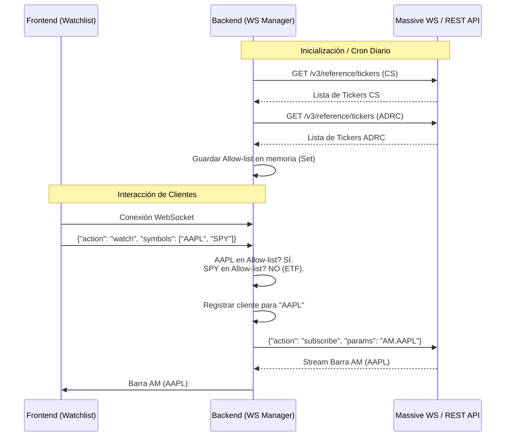

# PRD: Filtrado de Instrumentos en el WebSocket de Massive

Este documento define las especificaciones de producto y técnicas para implementar un filtrado estricto de instrumentos en la transmisión de datos a través del WebSocket de Massive. El objetivo es asegurar que la plataforma solo procese y retransmita datos de **acciones americanas comunes (CS) y ADRs comunes (ADRC)**, previniendo fugas de ETFs, warrants y otros instrumentos no deseados.

---

## 00 · Trazabilidad y Fuentes Auditadas

Este diseño se ancla directamente sobre el código existente y patrones de arquitectura del proyecto:

| Componente Real | Archivo | Línea/Método Relacionado | Propósito / Patrón a Reutilizar |
| :--- | :--- | :--- | :--- |
| **Cliente WebSocket de Massive** | [live_screener_service.py](file:///Users/jvch/Desktop/AutomatoWebs/BTT/backend/app/services/live_screener_service.py) | `_consume_massive_ws()` (L256) | Reutilizar el manejo de conexión, reconexión con backoff exponencial, y autenticación. |
| **Enrutador WebSocket de Clientes** | [screener.py](file:///Users/jvch/Desktop/AutomatoWebs/BTT/backend/app/routers/screener.py) | `screener_live()` (L212) | Patrón de FastAPI WebSocket para recibir peticiones del cliente y emitir actualizaciones. |
| **Cache de Tickers** | [cache_service.py](file:///Users/jvch/Desktop/AutomatoWebs/BTT/backend/app/services/cache_service.py) | `load_tickers_cache()` (L14) | Reutilizar para ver la categorización de tipos de tickers (`CS`, `ADRC`) en base de datos. |
| **WebSocket Frontend** | [Screener.tsx](file:///Users/jvch/Desktop/AutomatoWebs/BTT/frontend/src/components/Screener.tsx) | `wsRef` y conexión en `useEffect` (L508) | Patrón para interactuar con la conexión de WebSocket en el cliente React. |

---

## 01 · Viabilidad y Rendimiento

1. **Eficiencia en el Procesamiento (Hot Path):**
   El WebSocket de Massive en tiempo real procesa miles de mensajes por segundo. Filtrar los instrumentos mensaje a mensaje analizando metadatos del ticker degradaría el rendimiento del backend.
   * **Mitigación:** Aplicar el filtro en el momento de la **suscripción (allow-list)**. El backend solo se suscribirá a los canales `AM.<ticker>` de los símbolos que pertenezcan a la lista permitida.
2. **Uso de Memoria:**
   La lista de acciones y ADR comunes activos en el mercado de EE.UU. oscila entre los **7,000 y 8,000 símbolos**.
   * Un `Set[str]` en Python conteniendo esta lista consume aproximadamente **~100 KB** de RAM, lo cual es negligible para el backend.
3. **Límites de Suscripción en Massive:**
   La suscripción masiva de símbolos en un solo mensaje puede exceder los límites de tamaño de paquete del servidor de Massive.
   * **Mitigación:** Las suscripciones y desuscripciones dirigidas se enviarán agrupadas en lotes de máximo **1,000 símbolos** por mensaje.

---

## 02 · Requerimientos de Producto (PRD)

### 2.1 Criterios de Selección (Allow-list)
El sistema debe filtrar el universo de tickers basándose en las siguientes reglas estrictas:

* **Símbolos Permitidos:**
  * `CS` (Common Stock / Acción Común)
  * `ADRC` (American Depository Receipt Common / ADR Común)
* **Símbolos Excluidos (Exclusión Explícita):**
  * ETFs, ETNs, ETVs, ETSs, Warrants, ADRW, Rights, ADRR, Units, Bonds, Preferred Stocks (PFD), Fondos Mutuales (FUND) y SP.
* **Mercado y Ubicación:**
  * Solo mercado `stocks` (excluye automáticamente OTC).
  * Solo locale `US`.

### 2.2 Regla de Oro (Allow-list como Lista Blanca)
Cualquier instrumento que no se categorice explícitamente en el API de referencia de Massive como `CS` o `ADRC` activo queda excluido. No se permiten inclusiones por omisión.

---

## 03 · Contrato de Datos

### 3.1 Cliente (Frontend) ◄──► Backend Worker (WS)

* **Acción: Suscribirse a una Watchlist (`watch`)**
  Enviado por el Frontend para indicar los símbolos en pantalla que requiere observar.
  ```json
  {
    "action": "watch",
    "symbols": ["AAPL", "MSFT", "TSLA", "SPY"]
  }
  ```
  *(Nota: "SPY" es un ETF y el backend debe ignorarlo de la suscripción real).*

* **Acción: Desuscribirse (`unwatch`)**
  Enviado por el Frontend para dejar de observar símbolos específicos.
  ```json
  {
    "action": "unwatch",
    "symbols": ["AAPL"]
  }
  ```

* **Flujo de Datos (Mensaje `AM` - Aggregate Minute):**
  Enviado del Backend al Frontend con la barra consolidada de un minuto.
  ```json
  {
    "ev": "AM",
    "sym": "AAPL",
    "o": 189.10,
    "c": 189.40,
    "h": 189.60,
    "l": 188.90,
    "v": 12500,
    "s": 1700000000000,
    "e": 1700000060000
  }
  ```

### 3.2 Backend Worker ◄──► Massive WebSocket (`wss://socket.massive.com/stocks`)

* **Autenticación:**
  ```json
  {
    "action": "auth",
    "params": "<MASSIVE_API_KEY>"
  }
  ```

* **Suscripción de Canales:**
  El feed solicitado es `AM` (Aggregates por Minuto). Se formatean como `AM.<TICKER>`.
  ```json
  {
    "action": "subscribe",
    "params": "AM.AAPL,AM.MSFT,AM.TSLA"
  }
  ```

* **Desuscripción de Canales:**
  ```json
  {
    "action": "unsubscribe",
    "params": "AM.AAPL"
  }
  ```

---

## 04 · Flujo de Ejecución y Suscripción

El proceso dinámico de suscripción filtrada opera de la siguiente manera:



---

## 05 · Arquitectura Técnica (Backend)

La lógica se organizará en el backend de FastAPI bajo dos roles principales: el **Constructor de la Lista Blanca (Allowlist Builder)** y el **Gestor de Conexión WebSocket (Connection Manager)**.

### 5.1 Allowlist Builder
Se implementará una función asíncrona dedicada a alimentar la lista blanca desde la API REST de referencia de Massive:

* **Endpoint REST de Massive:**
  `GET {MASSIVE_REST_BASE}/v3/reference/tickers`
* **Parámetros obligatorios:**
  * `market=stocks` (Excluye OTC)
  * `active=true`
  * `limit=1000`
  * `type=CS` (Llamada 1) y `type=ADRC` (Llamada 2)
* **Paginación:** Seguir recursivamente el campo `next_url` retornado en la respuesta hasta que no haya más páginas.
* **Frecuencia:**
  * Se construye al levantar la aplicación.
  * Se refresca automáticamente una vez al día (ej. 4:00 AM EST, pre-mercado) mediante un cron job o tarea en background.
  * *Mecanismo defensivo:* Si la llamada al API falla durante la actualización diaria, se conserva el `Set` previo para evitar que el servicio quede sin suscripciones.

### 5.2 Connection Manager (MassiveWSManager)
Un objeto singleton en el backend que encapsula la única conexión permitida a Massive:

1. **Estado en Memoria:**
   * `allowlist: Set[str]`: Tickers permitidos.
   * `active_subscriptions: Set[str]`: Tickers suscritos actualmente en Massive.
   * `symbol_to_clients: Dict[str, List[WebSocket]]`: Mapa para saber qué clientes están observando cada ticker.

2. **Gestión de Suscripciones (Watch/Unwatch):**
   * Cuando un cliente envía `"watch"`, el backend intersecta los símbolos con el `allowlist`.
   * Si un símbolo es válido y no está en `active_subscriptions`, se agrega a una cola de suscripción y se envía el mensaje `subscribe` a Massive.
   * Se registra la referencia del socket del cliente en `symbol_to_clients[ticker]`.

3. **Retransmisión y Validación Defensiva (Capa 2):**
   * Al recibir una barra `AM` desde Massive, se extrae el ticker (`ev.sym`).
   * *Validación defensiva:* Se verifica `ev.sym in allowlist`. Si es falso (por algún error de reasignación o fuga del servidor), el mensaje es descartado inmediatamente y no se transmite.
   * Si es válido, se retransmite únicamente a los WebSockets en `symbol_to_clients[ev.sym]`.

4. **Reconciliación y Limpieza:**
   * Al desconectarse un cliente frontend, se le remueve de todas las listas de suscriptores en `symbol_to_clients`.
   * Si para un ticker dado la lista de clientes queda vacía (`len(symbol_to_clients[ticker]) == 0`), se envía un comando `unsubscribe` a Massive y se retira el ticker de `active_subscriptions`.

---

## 06 · Plan de Verificación y Ejecución

Para garantizar la correcta ejecución sin depender de credenciales reales de Massive en entornos de desarrollo local, se provee la siguiente guía de pruebas.

### 6.1 Simulación Local de Respuestas REST
Si no se dispone de una key activa de Massive para probar la paginación REST de `/v3/reference/tickers`, se puede mockear la llamada HTTP en desarrollo utilizando un archivo JSON local que emule el payload de Massive:

```json
{
  "results": [
    {"ticker": "AAPL", "type": "CS", "active": true},
    {"ticker": "MSFT", "type": "CS", "active": true},
    {"ticker": "BABA", "type": "ADRC", "active": true},
    {"ticker": "SPY", "type": "ETF", "active": false}
  ],
  "status": "OK"
}
```

### 6.2 Comandos y Scripts de Prueba

Un script de scratch para validar la conexión y verificar que los filtros excluyen ETFs/Warrants se ubicará en la carpeta de pruebas/scratch del backend:

`backend/app/scratch/test_massive_subscription.py`

#### Script de Prueba Sugerido:
```python
import asyncio
import json
import websockets

async def test_subscription():
    uri = "ws://localhost:8000/api/screener/live"  # O el host correspondiente
    async with websockets.connect(uri) as websocket:
        # Enviar petición con un símbolo válido (CS) y uno inválido (ETF)
        payload = {
            "action": "watch",
            "symbols": ["AAPL", "SPY", "BABA"]
        }
        await websocket.send(json.dumps(payload))
        print("Enviado watch request para AAPL (CS), SPY (ETF), BABA (ADRC)")
        
        # Escuchar mensajes y validar que no llegue nada de SPY
        try:
            for _ in range(10):
                response = await websocket.recv()
                data = json.loads(response)
                print(f"Recibido del WS: {data}")
                assert data.get("sym") != "SPY", "ERROR: Se filtró el ETF SPY al cliente!"
        except asyncio.TimeoutError:
            print("Verificación de timeout terminada.")

if __name__ == "__main__":
    asyncio.run(test_subscription())
```

### 6.3 Casos de Prueba Críticos para Aceptación
1. **Verificar que no hay fugas:** Enviar una suscripción que contenga `AAPL` y `SPY`. Confirmar que solo se envía suscripción a Massive para `AAPL` y que no se reciben datos de `SPY`.
2. **Reconexión y Re-suscripción:** Cortar la conexión del backend con Massive temporalmente. Al reconectarse, validar que el backend reenvía automáticamente las suscripciones activas del watchlist actual.
3. **Limpieza en desconexión:** Desconectar un cliente frontend. Validar en logs que se realiza la desuscripción de Massive para los tickers que ya no tengan observadores activos.
